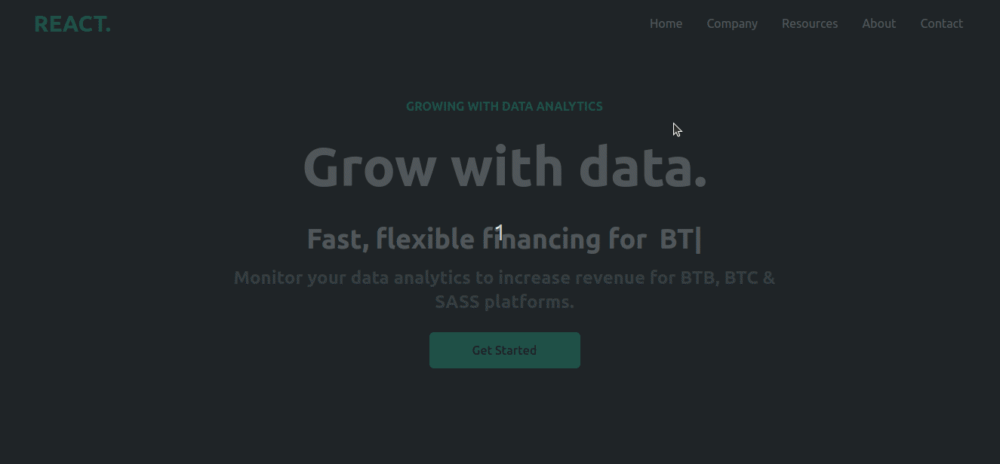

# Landing Page - React & Tailwind 💻🛍️💻🛍️💻🛍️

> # Description 

A landing page made with React and styled with Tailwind CSS. The page simulates a Data Analytics company. It features cards with different types of plans for customers, newsletter subscription input, and social media buttons.

## 🛠️ Technologies 

- React
- Tailwind
- Git and Github
